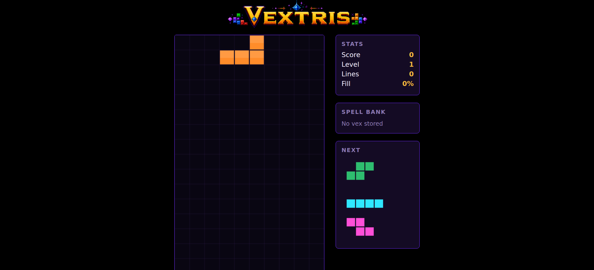
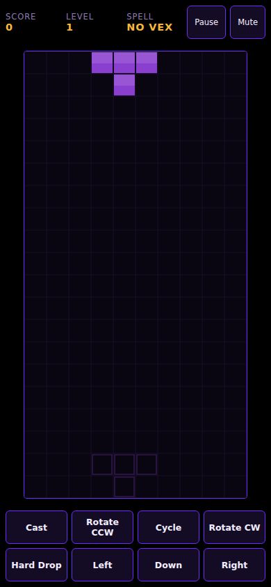

# Vextris

**An arcane falling-block puzzle game with earned spells, neon glyphs, and arcade high scores.**

[**Play Vextris in your browser**](https://xbillwatsonx.github.io/vextris/)

<p align="center">
  
</p>

<p align="center">
  
</p>

## What it is

Vex glyphs ✦ appear on random falling blocks. Lock two marked cells together to earn a spell, then use it to reshape the board. Clear lines, survive rising speed, and make the local top-ten scoreboard.

- Canvas-rendered playfield with a dark jewel-tone arcade style
- Deterministic game engine with seed-locked tests
- Three Vex spells: Color, Shape, and Shadow
- Local top-ten scores with three-letter initials
- Keyboard play on desktop and a dedicated touch dock on phones
- Programmatic effects and adaptive background music

## Play

Open the [GitHub Pages build](https://xbillwatsonx.github.io/vextris/). On desktop, press any key through the intro and instructions. On a phone, tap through those screens and use the touch-first instructions and dock.

## Controls

### Keyboard

| Action | Key |
|---|---|
| Move left / right | ← / → |
| Soft drop | ↓ |
| Hard drop | Space |
| Rotate clockwise | ↑ |
| Rotate counter-clockwise | Z |
| Cycle selected spell | C |
| Cast selected spell | V |
| Pause / resume | P or Esc |
| Mute / unmute | M |

### Touch

| Control | What it does |
|---|---|
| Cast | Cast the selected spell |
| Rotate CCW / Rotate CW | Turn the falling piece |
| Cycle | Select the next earned spell |
| Hard Drop | Place the falling piece immediately |
| Left / Right | Hold to move horizontally |
| Down | Hold to soft drop |
| Pause / Mute | Available in the mobile HUD above the board |

Touch controls are shown for coarse-pointer portrait play. Buttons use at least 48px targets, suppress text selection/callouts, support pointer and click activation, and clean up held input if the app loses focus.

## Spells

| Spell | Effect |
|---|---|
| **Color Vex** ◆ | Clears every cell of one random color. |
| **Shape Vex** ◈ | Clears every cell matching one random piece shape. |
| **Shadow Vex** ◉ | Inverts the board; requires at least 40% fill. |

## High scores and initials

Scores are stored locally in the browser. If a run reaches the top ten, enter three initials:

- **Desktop:** type A–Z, Backspace to correct, Enter to save.
- **Touch:** tap the on-screen A–Z keypad, then **Backspace** or **Confirm**.
- Leaving all slots blank saves `AAA`.

## Run locally

```bash
npm ci
npm run dev
```

Vite prints the local URL. For a production-like local check:

```bash
npm run build
npm run preview
```

## Verify

```bash
npm test       # full Vitest suite
npm run lint   # strict TypeScript-aware ESLint
npm run build  # type-check, Vite build, and music asset copy
```

`just test`, `just lint`, and `just build` provide the same project checks when `just` is installed.

## Accessibility and support notes

- Native semantic buttons expose accessible labels and visible keyboard focus.
- Pause and mute controls keep their labels and `aria-pressed` state in sync.
- Touch targets are designed for a minimum 48px height; text selection and iOS callouts are disabled on interactive controls.
- The game requires modern browser support for Canvas, Web Audio, Pointer Events, and localStorage. Current Chrome, Edge, Firefox, and Safari are the intended support baseline. Mobile testing has been performed on a real phone and with portrait viewport emulation.
- Background audio begins only after a player gesture, in line with browser autoplay policies.

## Development notes

Vextris uses TypeScript, Vite, Vitest, Canvas, and Web Audio. There are no runtime framework dependencies. The full product and technical specification is at [`docs/Vextris_PRD_and_Technical_Spec.md`](docs/Vextris_PRD_and_Technical_Spec.md).

## License

No license has been selected yet. A license decision is separate from the v0.3.0 release and does not block it.

---

Built by [Bill Watson](https://github.com/xbillwatsonx).